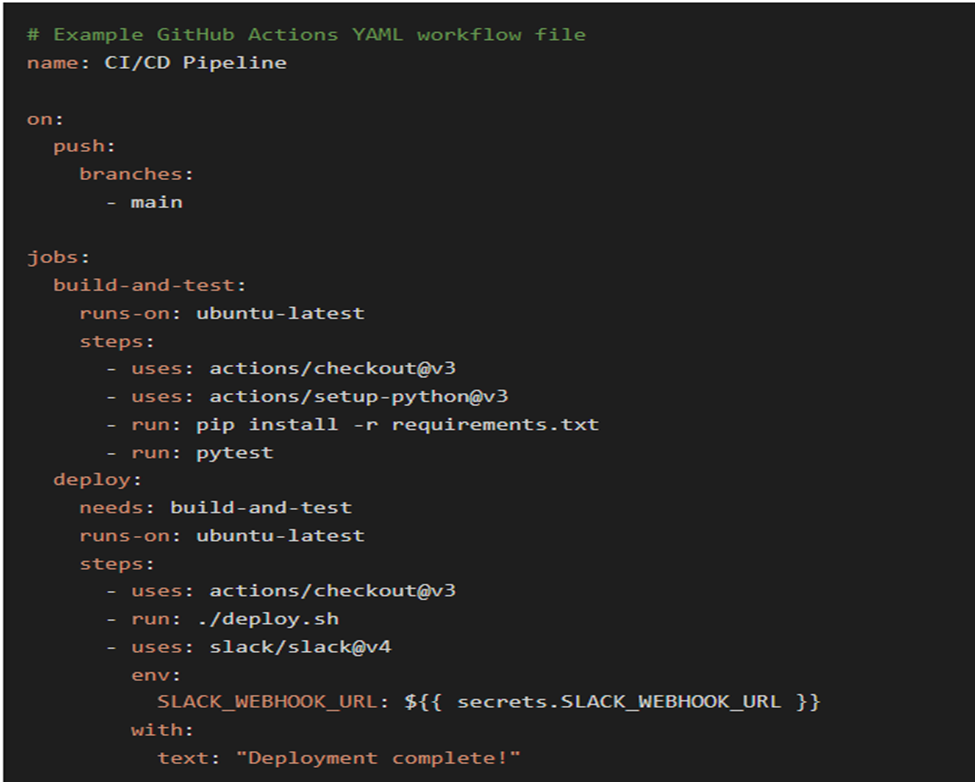

# SE-Assignment-4
Assignment: GitHub and Visual Studio
Instructions:
Answer the following questions based on your understanding of GitHub and Visual Studio. Provide detailed explanations and examples where appropriate.

Questions:
Introduction to GitHub:

What is GitHub, and what are its primary functions and features? Explain how it supports collaborative software development.
GitHub is a web-based platform that allows developers to store, manage, and collaborate on code projects.
Primary Functions and Features of GitHub
    1.	Version Control- GitHub uses the distributed version control system Git, which allows multiple developers to work on different versions of a project simultaneously.
    2.	Collaboration- GitHub facilitates team collaboration through features such as issue tracking, pull requests, and code reviews.
    3.	Code Hosting- Developers can store their code repositories on GitHub, allowing them to track changes, share code, and collaborate with others.
    4.	Web Interface- GitHub provides a user-friendly web interface that makes it easy to navigate repositories, track changes, and collaborate with team members.

 GitHub supports collaborative software development by:
Branching and Merging- GitHub enables developers to create branches from the main codebase, make changes, and merge them back into the main branch, facilitating parallel development.
Pull Requests- Developers can create pull requests to submit their changes for review and discussion before merging. This allows for code reviews and feedback prior to integration.
Issue Tracking- GitHub provides issue tracking tools that allow teams to track bugs, feature requests, and tasks related to a project.
Project Management- GitHub has project management features such as milestones and labels, enabling teams to organize and track progress.
Community Support- GitHub provides access to a vast community of developers, forums, and documentation, fostering knowledge sharing and collaboration.
   

Repositories on GitHub:

What is a GitHub repository? Describe how to create a new repository and the essential elements that should be included in it.

What is a GitHub Repository?
A GitHub repository is a collection of code, assets, and documentation that represents a specific project or piece of software. It can be private or public. 
Creating a New Repository
To create a new repository on GitHub:
    1.	Go to the GitHub website and sign in to your account.
    2.	Click on the "+" icon in the top-right corner and select "New repository."
    3.	Enter a repository name and description.
    4.	Choose whether to make the repository public or private.
    5.	Click "Create repository."
Essential Elements of a GitHub Repository
Every repository should include the following essential elements:
    •	README.md: A markdown file that provides a brief overview of the project, installation instructions, and other relevant information.
    •	LICENSE.md: A file that specifies the license under which the project is distributed.
    •	.gitignore: A file that indicates which files or directories should be ignored by Git.
    •	Code: The actual source code for the project.
    •	Issues: A list of known issues or feature requests related to the project.
    •	Pull Requests: Proposals for changes to the codebase that can be reviewed and merged.
    •	Wiki: A space for storing documentation or other non-code content.
    •	Actions: Automated workflows that can be triggered by events in the repository (e.g., builds, tests, deployments).

Version Control with Git:

Explain the concept of version control in the context of Git. How does GitHub enhance version control for developers?
Git is a distributed Version Control System, meaning that every developer has a complete copy of the code repository on their local machine.
Git organizes code into commits. Each commit contains a record of all changes made to the code at that time, along with metadata such as the author, date, and a brief description.

GitHub and Version Control
 
GitHub enhances version control for developers by providing:

•	Centralized Code Repository- GitHub allows developers to store and share their code repositories in a single, centralized location.
•	Web-Based Interface- GitHub provides a web-based interface for managing repositories, viewing commit history, and collaborating with others.
•	Collaboration Tools- GitHub offers features such as pull requests, issues, and wikis to facilitate team collaboration and communication.
•	Integration with Other Services- GitHub integrates with various third-party services, such as continuous integration and deployment tools, to streamline development and deployment processes.

Benefits of GitHub for Version Control

•	Remote Code Storage- Developers can store their Git repositories on GitHub, ensuring code backup and accessibility from anywhere.
•	Collaboration and Code Sharing- GitHub allows multiple developers to work on the same codebase, share changes, and merge updates securely.
•	Version History and Tracking- GitHub provides a comprehensive view of the code history, making it easy to trace changes and revert to previous versions.
•	Code Review and Feedback- GitHub's pull request feature enables team members to review and provide feedback on code changes before merging them into the main repository.
•	Cloud-Based Collaboration- GitHub's cloud-based platform eliminates the need for local servers and allows developers to collaborate remotely.

Branching and Merging in GitHub:

What are branches in GitHub, and why are they important? Describe the process of creating a branch, making changes, and merging it back into the main branch.

Branches in GitHub are parallel versions of a repository that allow developers to work on different features or changes without affecting the main codebase. They enable multiple developers to collaborate simultaneously without overwriting each other's changes.
Importance of Branches
Branches are crucial in software development for:
•	Isolation- They isolate changes and prevent unintended conflicts with the main codebase.
•	Collaboration- They facilitate collaboration by allowing multiple developers to work on different aspects of the project simultaneously.
•	Testing- They provide a safe environment to test new features or bug fixes before merging them into the main branch.
•	Versioning- They create a history of changes and allow for easy rollback to previous versions if necessary.
Creating a Branch
To create a branch in GitHub:
    1.	Navigate to the repository you want to branch from.
    2.	Click on the "Code" tab.
    3.	Click on the "Branches" dropdown and select "New branch."
    4.	Enter a name for the new branch and click on the "Create branch" button.
Making Changes and Committing
Once a branch is created, you can make changes to it. To commit those changes:
Make the desired changes to the code.
Stage the changes by running the command.
    git add . 
Commit the staged changes with a meaningful message using the command.
    git commit
Merging Back into the Main Branch
Once you have made your changes and tested them in the branch, you can merge them back into the main branch. To do this:
Switch to the main branch using the command.
    git checkout main
Pull the latest changes from the remote repository using the command.
    git pull
Merge the branch into the main branch using the command.
    git merge <branch-name>
Push the merged changes to the remote repository using the command.
    git push

Pull Requests and Code Reviews:

What is a pull request in GitHub, and how does it facilitate code reviews and collaboration? Outline the steps to create and review a pull request.

A pull request in GitHub is a feature that allows team members to propose changes to a shared code. It serves as a platform for code reviews, discussions, and collaboration before merging the changes into the main repository.
How Pull Requests Facilitate Code Reviews and Collaboration:
Centralized Code Review: PRs provide a central location where team members can review and discuss proposed changes, ensuring that code meets standards and quality guidelines.
Feedback and Discussion: Other collaborators can comment on PRs, ask questions, and suggest improvements, fostering a collaborative code review process.
Change Tracking: PRs track the changes between the proposed code and the current version, making it easy to identify what's being added, removed, or modified.
Conflict Resolution: If conflicts arise due to concurrent code changes, PRs make it easier to resolve them through discussion and merging techniques.
Code Approvals: PRs allow team members to formally approve or reject changes before they are merged, ensuring that only high-quality code is accepted into the main repository.
Steps to Create and Review a Pull Request:
Creating a Pull Request:
    1.	Make changes to the code locally.
    2.	Stage and commit the changes.
    3.	Push the changes to a remote branch.
    .	Navigate to GitHub and create a new pull request from your branch to the main branch.
Reviewing a Pull Request:
    1.	Open the pull request in GitHub.
    2.	Examine the changes using the "Files changed" tab.
    3.	Leave comments and suggest improvements inline with the code.
    4.	Discuss the changes with the author in the "Discussion" tab.
    5.	Approve or reject the changes using the "Review" tab.

GitHub Actions:

Explain what GitHub Actions are and how they can be used to automate workflows. Provide an example of a simple CI/CD pipeline using GitHub Actions.

GitHub Actions are a workflow automation engine that allows developers to automate and customize software development processes directly within GitHub. They enable users to define a set of tasks that are executed when specific events occur, such as code check-ins, pull requests, or issue creation.
How GitHub Actions Automate Workflows.

GitHub Actions provides a range of features to automate workflows:
Customizable Workflows: Users can define custom workflows that specify the steps and tasks to be executed.
Event Triggers: Workflows can be triggered by various events within GitHub, such as commits, pull requests, or schedules.
Predefined Actions: GitHub offers a library of predefined actions for common tasks, such as building, testing, and deploying code.
Integration with GitHub Tools: Actions integrate seamlessly with other GitHub tools like Issues, Pull Requests, and Projects.

Example of a Simple CI/CD Pipeline Using GitHub Actions
Continuous Integration (CI):
    •	Build Action: Triggers when code is pushed to a specific branch, initiating a build process.
    •	Test Action: Runs unit tests and reports results.
    •	Coverage Action: Analyzes code coverage and reports metrics.
Continuous Delivery (CD):
    •	Deploy Action: Deploys the built and tested code to a staging or production environment.
    •	Notification Action: Sends notifications to stakeholders when the deployment is complete.
Workflow Configuration:

Introduction to Visual Studio:

What is Visual Studio, and what are its key features? How does it differ from Visual Studio Code?

Visual Studio is a comprehensive integrated development environment (IDE) created by Microsoft for developing software. It provides a wide range of tools and features that streamline the development process.

Key Features:
Cross-platform development: Supports multiple programming languages and platforms, including Windows, macOS, Linux, iOS, Android, and the web.
Modern coding experience: Features IntelliSense, autocompletion, and refactoring tools to improve coding efficiency.
Team collaboration: Facilitates code sharing, review, and version control using Azure DevOps.
Cloud support: Integrates with Azure cloud services for deploying, managing, and monitoring applications.
Enterprise-grade tooling: Offers advanced features for large-scale development, such as code analysis, architecture tools, and performance profiling.

Visual Studio Code (VS Code)
Visual Studio Code is a lightweight and open-source code editor developed by Microsoft. It is designed for developers who prefer a more focused and customizable coding experience.

Key Features:

Free and open source: Available for free on multiple platforms.
Light and fast: Optimized for speed and responsiveness.
Extensible: Supports a vast ecosystem of plugins and themes.
Integrated terminal: Allows running commands and tools within the editor.
Debugging: Provides basic debugging capabilities.

Differences Between Visual Studio and VS Code:

Target audience: Visual Studio is geared towards professional developers working on large-scale projects, while VS Code is suitable for personal or small-team projects.
Features: Visual Studio offers a more comprehensive set of features, including enterprise-grade tooling and cloud integration.
Cost: Visual Studio is a paid product, while VS Code is free to use.
Learning curve: Visual Studio has a steeper learning curve due to its extensive features.
Extensibility: Both Visual Studio and VS Code support extensions, but Visual Studio offers a wider selection of enterprise-level plugins.

Integrating GitHub with Visual Studio:

Describe the steps to integrate a GitHub repository with Visual Studio. How does this integration enhance the development workflow?

Steps to Integrate GitHub with Visual Studio:
    1.	Install Git and  Visual Studio into your machine
    2.	Sign In to GitHub
    3.	Connect a Repository: Click on "Connect to Existing Repository." Browse and select the GitHub repository you want to connect.
    4.	Clone Repository: Visual Studio will clone the repository locally to your computer.

Benefits of GitHub Integration with Visual Studio in enhancing workflow:

    1. Team Collaboration and Version Control: Multiple developers can work on the same project simultaneously, Changes are tracked and versioned, allowing for easy rollbacks and collaboration history.
    2. Issue Tracking and Code Reviews: It allows users to create and track issues directly in Visual Studio, linking them to specific code changes.
    3. Pull Request Management: Allows users to seamlessly create and review pull requests from Visual Studio.
    . Branch Management: Manage multiple branches locally and on GitHub by allowing users to create, merge, and delete branches from within Visual Studio.
    5. Conflict Resolution: Visual Studio provides tools to help resolve merge conflicts efficiently.
    6. Productivity Enhancements: Access GitHub features directly in the Visual Studio interface, saving time and effort. 

Debugging in Visual Studio:

Explain the debugging tools available in Visual Studio. How can developers use these tools to identify and fix issues in their code?

Visual Studio offers the following debugging tools that enable developers to identify and resolve issues in their code efficiently:
    1. Breakpoints: Allows developers to pause program execution at specific lines or locations to examine variable values, step through code, and debug issues.
    2. Step Debugging: Stepwise execution of code, allowing developers to trace the flow of execution and identify any unexpected behavior.
        •	Step Over: Executes the current line of code without entering methods.
        •	Step Into: Enters a method call and executes the code line by line.
        •	Step Out: Returns execution to the calling method.
    3. Data Inspection: This includes
    •	Watch Window: Monitors the values of variables in real-time, allowing developers to track changes and identify any unexpected values.
    •	Locals Window: Displays the local variables in the current scope.
    •	Auto Window: Shows the values of variables and objects that are automatically generated by Visual Studio.
    4. Call Stack: Shows the history of method calls and provides insights into the sequence of events leading to an issue.
    5. Exception Handling: Exception Assistant: This feature guided developers through the process of analyzing and resolving exceptions.
    6. Diagnostics Tools:
    •	Performance Profiler: Analyzes the performance of code and identifies bottlenecks or inefficient operations.
    •	Diagnostic Tools: Log errors and provide insights into the behavior of the program.

Developers use debugging Tools to:
•	Set breakpoints to pause execution at specific locations.
•	Step through code using the Debugger tab or keyboard shortcuts.
•	Inspect variable values using the Watch or Locals windows.
•	Examine the call stack to trace the flow of execution.
•	Handle exceptions and use the Exception Assistant to resolve them.
•	Use diagnostics tools to analyze performance and identify issues.
•	Take advantage of productivity enhancements to streamline the debugging process.

Collaborative Development using GitHub and Visual Studio:

Discuss how GitHub and Visual Studio can be used together to support collaborative development. Provide a real-world example of a project that benefits from this integration.

GitHub and Visual Studio are two powerful tools used in software development. When integrated, they offer a comprehensive platform for collaborative development, allowing multiple developers to work on the same project efficiently and seamlessly.

Benefits of GitHub-Visual Studio Integration:

Code Sharing and Version Control: GitHub provides a central repository for code, allowing developers to share, track changes, and collaborate on projects. Visual Studio integrates directly with GitHub, enabling developers to push, pull, and merge code changes without leaving their IDE.
Issue Tracking and Collaboration: GitHub allows teams to track issues, bugs, and feature requests. Visual Studio has built-in support for GitHub, making it easy to view, create, and link issues to code changes. This facilitates effective communication and coordination among developers.
Pull Request Management: GitHub's pull request mechanism allows developers to propose changes to the codebase. Visual Studio supports reviewing, approving, and merging pull requests, streamlining the code review and approval process.
Continuous Integration and Deployment: GitHub can be integrated with continuous integration and deployment (CI/CD) tools, such as Azure Pipelines. Visual Studio supports building and deploying projects directly to GitHub, automating the testing and delivery process.

Real-World Example: Open-Source Library Development
Project: A popular open-source library used in web development
Workflow:
    1.	The project repository is hosted on GitHub.
    2.	Developers clone the repository into Visual Studio, enabling them to modify and contribute to the code.
    3.	New features or bug fixes are implemented in separate branches.
    4.	Developers use Visual Studio's integrated GitHub features to create pull requests, prompting code reviews and comments.
    5.	The project lead merges approved changes into the master branch, updating the repository on GitHub.
    6.	GitHub's issue tracking system is used to manage bug reports and feature requests, ensuring they are addressed and prioritized.
    7.	Project boards in GitHub are used to track the progress of different development tasks, providing visibility into the team's workflow.
This integration enables efficient collaboration among multiple developers, ensuring code quality, timely issue resolution, and transparent progress tracking.

Submission Guidelines:
Your answers should be well-structured, concise, and to the point.
Provide real-world examples or case studies wherever possible.
Cite any references or sources you use in your answers.
Submit your completed assignment by [due date].
